# CAPÍTULO I: INTRODUCCIÓN Y FUNDAMENTOS

## 1.1. Introducción al Desarrollo Asistido por IA: El Espectro Chat vs. Agente

El paradigma de la ingeniería de software está experimentando una transición crítica impulsada por la incorporación de Modelos de Lenguaje de Gran Escala (LLMs). Esta evolución no es uniforme, sino que se distribuye a lo largo de un espectro operativo definido por el nivel de autonomía y la naturaleza de la interacción entre el desarrollador humano y la entidad estocástica de IA. Este espectro se divide principalmente en dos metodologías dominantes:

### 1.1.1. Asistencia Conversacional Pura (Enfoque Chat)
Este extremo del espectro se caracteriza por un flujo de interacción de tipo síncrono y de grano fino. El desarrollador utiliza interfaces conversacionales para delegar tareas atómicas, tales como la refactorización de funciones aisladas, la explicación de algoritmos complejos o la interpretación de trazas de error (*stack traces*). 

Si bien este enfoque mantiene al ser humano firmemente en el bucle de control (*Human-in-the-Loop* o HITL), sufre de una alta fricción operativa: el ingeniero debe actuar como un puente analógico, copiando, editando y transfiriendo manualmente fragmentos de código e información de contexto entre el entorno de desarrollo integrado (IDE) y la interfaz de la IA.

### 1.1.2. Ejecución Autónoma Basada en Objetivos (Enfoque Agente)
En el extremo opuesto se ubican los agentes autónomos de código. Estas entidades operan de manera asíncrona a partir de un objetivo abstracto de alto nivel (ej. *"Implementar el módulo de recuperación de contraseñas"*). Los agentes cuentan con herramientas (*tool-use*) que les permiten interactuar directamente con el sistema de archivos, ejecutar comandos en la terminal, leer el árbol del repositorio y realizar llamadas cíclicas a los LLMs para auto-corregir sus propios errores. 

A pesar de su alto potencial de productividad, el enfoque de agente carece actualmente de restricciones metodológicas rígidas, lo que suele derivar en la modificación impredecible de archivos o en la adopción de decisiones de diseño que violan las reglas de arquitectura preestablecidas.

```mermaid
graph TD
    subgraph Chat ["1. Enfoque Chat (Alta Fricción)"]
        H1[Desarrollador Humano] -- "Copia Contexto Manual" --> LLM1[LLM / Chat]
        LLM1 -- "Genera Snippet" --> H1
        H1 -- "Pega Código" --> IDE1[Repositorio / IDE]
    end

    subgraph Agent ["2. Enfoque Agente Ad-Hoc (Riesgo de Deriva)"]
        H2[Desarrollador Humano] -- "Prompt de Alto Nivel" --> AG2[Agente Autónomo]
        AG2 -- "Lectura/Escritura Libre" --> IDE2[Repositorio / IDE]
        IDE2 -. "Sin Barreras de Arquitectura" .-> Chaos[Modificaciones Indeadas]
    end

    subgraph SDAP ["3. Enfoque SDAP (Gobernanza Restringida)"]
        H3[Desarrollador Humano] -- "Co-Diseño & Filtro" --> SPEC[".sdap/ & docs/ai/"]
        SPEC -- "Restricciones & Contexto Atómico" --> AG3[Agente Autónomo]
        AG3 -- "Ejecución Acotada" --> IDE3[Repositorio / IDE]
    end

```

---

## 1.2. El Problema del Contexto en los Transformadores

Para comprender las ineficiencias del desarrollo asistido por IA actual, es imperativo analizar las limitaciones físicas y matemáticas de la arquitectura de red neuronal que hace posibles a los LLMs: el *Transformer* y su mecanismo de auto-atención (*Self-Attention*).

### 1.2.1. Ventanas de Contexto y Costo de Tokens
La ventana de contexto ($C_w$) define el límite estricto de datos (medido en tokens) que un modelo puede procesar en una sola iteración hacia adelante (*forward pass*). Aunque los modelos modernos ofrecen ventanas de contexto nominales masivas (desde 128k hasta un millón de tokens), el costo computacional de procesar contextos saturados escala de forma cuadrática $O(N^2)$ en términos de la longitud de la secuencia debido a las matrices de atención. 

Esto se traduce en un incremento lineal en los costos financieros por consumo de tokens de entrada (*input tokens*) y un aumento drástico en la latencia de respuesta, volviendo inviable la práctica común de inyectar repositorios de código completos para resolver cambios locales.

### 1.2.2. El Fenómeno *Lost in the Middle* (Perdido en el Medio)
Estudios empíricos de la ciencia de la computación han demostrado que la capacidad de recuperación de información de un LLM no es uniforme a lo largo de su ventana de contexto. Los mecanismos de atención demuestran un sesgo de posición en forma de U: retienen con alta precisión la información ubicada al inicio (*primacy effect*) y al final (*recency effect*) del prompt, pero sufren una severa degradación en la precisión de recuperación cuando los datos críticos se encuentran en el centro del payload inyectado. 

En el desarrollo de software, si las especificaciones de arquitectura o las firmas de los métodos quedan sepultadas en medio de miles de líneas de código fuente enviado a la IA, el modelo exhibirá fallos de atención, traduciéndose en alucinaciones semánticas o sintácticas.

---

## 1.3. Justificación del Estándar SDAP: La Arquitectura de Doble Capa

La ingeniería de software tradicional cuenta con marcos metodológicos maduros (como Scrum, XP o TDD) diseñados para mitigar la ambigüedad humana y asegurar la calidad del producto. No obstante, no existe actualmente un marco homólogo que gobierne la interacción entre el desarrollador y las capacidades cognitivas de un LLM. El desarrollo asistido por IA se ejecuta de manera artesanal y sin predictibilidad.

El estándar **Spec-Driven Agentic Programming (SDAP)** se justifica como una respuesta metodológica y científica a las deficiencias del uso empírico de la IA. SDAP reconfigura la relación de trabajo bajo una premisa fundamental: **el humano diseña y restringe; la IA ejecuta e implementa**.

Para resolver la deriva de contexto y las violaciones de arquitectura, SDAP introduce una **arquitectura de información estructurada en dos capas complementarias**:

1. **Capa 0: Gobernanza y Genoma del Proyecto (`.sdap/`):** Una suite de especificaciones inmutables expresadas en Markdown y diagramas Mermaid que definen las fronteras de arquitectura (`ARCH_SKELETON.md`), las reglas de negocio puras (`DOMAIN_LOGIC.md`) y los modelos de datos (`DATA_MINDMAP.md`).
2. **Capa 1: Contexto Vivo de Código (`docs/ai/`):** Una estructura de 15 archivos temáticos agnósticos a la tecnología que sirven como mapa de navegación del sistema existente para el agente (patrones UI, convenciones, servicios, manejo de dependencias y barreras de contención).
