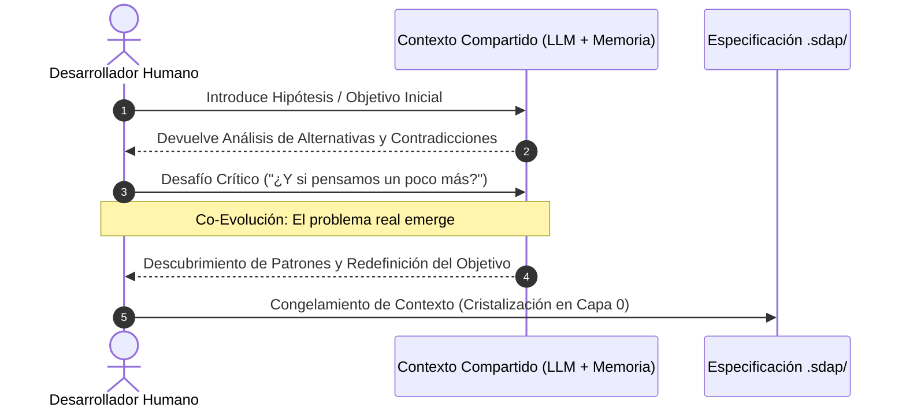

# CAPÍTULO I: INTRODUCCIÓN, FUNDAMENTOS Y EPISTEMOLOGÍA SDAP

## 1.1. Introducción al Desarrollo Asistido por IA: El Espectro Chat vs. Agente

El paradigma de la ingeniería de software está experimentando una transición crítica impulsada por la incorporación de Modelos de Lenguaje de Gran Escala (LLMs). Esta evolución no es uniforme, sino que se distribuye a lo largo de un espectro operativo definido por el nivel de autonomía, el control de contexto y la naturaleza de la interacción entre el desarrollador humano y la entidad estocástica de IA.

```mermaid
graph TD
    subgraph Chat ["1. Enfoque Chat Transaccional (Alta Fricción)"]
        H1[Desarrollador Humano] -- "Copia Contexto Manual" --> LLM1[LLM / Chat]
        LLM1 -- "Respuesta Directa / Snippet" --> H1
        H1 -- "Pega Código Manualmente" --> IDE1[Repositorio / IDE]
    end

    subgraph Agent ["2. Enfoque Agente Ad-Hoc (Riesgo de Deriva)"]
        H2[Desarrollador Humano] -- "Prompt Abstracto de Alto Nivel" --> AG2[Agente Autónomo]
        AG2 -- "Lectura/Escritura Libre" --> IDE2[Repositorio / IDE]
        IDE2 -. "Sin Barreras ni Memoria de Arquitectura" .-> Chaos[Deuda Técnica y Alucinaciones]
    end

    subgraph SDAP ["3. Enfoque SDAP (Co-Evolutivo y Gobernado)"]
        H3[Desarrollador Humano] <--> |"Inception Dialéctica & Objetivo Emergente"| LLM3[LLM / Compañero de Razonamiento]
        LLM3 --> SPEC[".sdap/ & docs/ai/ (Genoma y Contexto Vivo)"]
        SPEC -- "Restricciones & Contexto Atómico" --> AG3[Agente de Ejecución]
        AG3 -- "Ejecución Determinista Acotada" --> IDE3[Repositorio / IDE]
    end
```

### 1.1.1. Asistencia Conversacional Pura (Enfoque Chat)
Este extremo se caracteriza por un flujo de interacción de grano fino y de naturaleza síncrona. El desarrollador utiliza interfaces conversacionales para resolver preguntas puntuales ("¿Cómo refactorizo esta función?" o "Explícame esta traza de error").

Aunque mantiene al humano en el bucle de control (Human-in-the-Loop o HITL), padece de un sesgo transaccional: Pregunta → Respuesta → Fin. El ingeniero actúa como un puente analógico copiando y pegando contexto, perdiendo la oportunidad de construir una memoria sistémica compartida con el modelo.

### 1.1.2. Ejecución Autónoma Basada en Objetivos (Enfoque Agente)
En el extremo opuesto operan los agentes autónomos con capacidad de uso de herramientas (tool-use). A partir de una instrucción abstracta de alto nivel (ej. "Implementar el módulo de recuperación de contraseñas"), el agente lee el árbol de archivos, ejecuta comandos y modifica el repositorio libremente.

A pesar de su velocidad percibida, este enfoque carece de restricciones metodológicas. Al no poseer un mapa del dominio ni barreras de arquitectura, el agente frecuentemente altera componentes no relacionados, reescribe interfaces existentes, introduce librerías no autorizadas y genera deuda técnica severa.

```mermaid
graph TD
    subgraph Chat ["1. Enfoque Chat (Alta Fricción)"]
        H1[Desarrollador Humano] -- "Copia Contexto Manual" --> LLM1[LLM / Chat]
        LLM1 -- "Genera Snippet" --> H1
        H1 -- "Pega Código" --> IDE1[Repositorio / IDE]
    end

    subgraph Agent ["2. Enfoque Agente Ad-Hoc (Riesgo de Deriva)"]
        H2[Desarrollador Humano] -- "Prompt de Alto Nivel" --> AG2[Agente Autónomo]
        AG2 -- "Lectura/Escritura Libre" --> IDE2[Repositorio / IDE]
        IDE2 -. "Sin Barreras de Arquitectura" .-> Chaos[Modificaciones Indeadas]
    end

    subgraph SDAP ["3. Enfoque SDAP (Gobernanza Restringida)"]
        H3[Desarrollador Humano] -- "Co-Diseño & Filtro" --> SPEC[".sdap/ & docs/ai/"]
        SPEC -- "Restricciones & Contexto Atómico" --> AG3[Agente Autónomo]
        AG3 -- "Ejecución Acotada" --> IDE3[Repositorio / IDE]
    end

```
---

## 1.2. El Problema del Contexto en los Transformadores

Para comprender las ineficiencias del desarrollo asistido por IA actual, es imperativo analizar las limitaciones físicas y matemáticas de la arquitectura de red neuronal que hace posibles a los LLMs: el *Transformer* y su mecanismo de auto-atención (*Self-Attention*).

### 1.2.1. Ventanas de Contexto y Costo de Tokens
La ventana de contexto ($C_w$) define el límite estricto de datos (medido en tokens) que un modelo puede procesar en una sola iteración hacia adelante (*forward pass*). Aunque los modelos modernos ofrecen ventanas de contexto nominales masivas (desde 128k hasta un millón de tokens), el costo computacional de procesar contextos saturados escala de forma cuadrática $O(N^2)$ en términos de la longitud de la secuencia debido a las matrices de atención. 

Esto se traduce en un incremento lineal en los costos financieros por consumo de tokens de entrada (*input tokens*) y un aumento drástico en la latencia de respuesta, volviendo inviable la práctica común de inyectar repositorios de código completos para resolver cambios locales.

### 1.2.2. El Fenómeno *Lost in the Middle* (Perdido en el Medio)
Estudios empíricos de la ciencia de la computación han demostrado que la capacidad de recuperación de información de un LLM no es uniforme a lo largo de su ventana de contexto. Los mecanismos de atención demuestran un sesgo de posición en forma de U: retienen con alta precisión la información ubicada al inicio (*primacy effect*) y al final (*recency effect*) del prompt, pero sufren una severa degradación en la precisión de recuperación cuando los datos críticos se encuentran en el centro del payload inyectado. 

En software, si las reglas de negocio, esquemas de BD o firmas de interfaces quedan sepultadas dentro de miles de líneas de código fuente inyectadas masivamente, la IA incurre en alucinaciones semánticas e ignora las directivas clave del proyecto.

---

## 1.3. Epistemología de SDAP: Co-Evolución del Contexto y el *Objetivo Emergente*

Frente a la vista tradicional que percibe a la Inteligencia Artificial como una simple herramienta de automatización, la metodología **Spec-Driven Agentic Programming (SDAP)** se fundamenta en una premisa epistemológica más profunda: **la IA como compañero de razonamiento y el contexto como conocimiento vivo co-evolutivo**.

### 1.3.1. El Ciclo Dialéctico vs. La Respuesta Rápida
SDAP postula que en problemas complejos de ingeniería de software, la respuesta inmediata rara vez es la solución correcta porque la pregunta inicial suele estar incompleta o mal formulada. SDAP sustituye la búsqueda de respuestas rápidas por un **bucle dialéctico de construcción de contexto**:

$$\text{Idea Inicial} \rightarrow \text{Construcción de Contexto} \rightarrow \text{Descubrimiento} \rightarrow \text{Refinamiento} \rightarrow \text{Nueva Comprensión}$$

En este proceso, la ventana de contexto de la IA y el modelo mental del desarrollador se enriquecen mutuamente en cada iteración.

```mermaid
sequenceDiagram
    autonumber
    actor H as Desarrollador Humano
    participant C as Contexto Compartido (LLM + Memoria)
    participant S as Especificación .sdap/

    H->>C: Introduce Hipótesis / Objetivo Inicial
    C-->>H: Devuelve Análisis de Alternativas y Contradicciones
    H->>C: Desafío Crítico ("¿Y si pensamos un poco más?")
    Note over H,C: Co-Evolución: El problema real emerge
    C-->>H: Descubrimiento de Patrones y Redefinición del Objetivo
    H->>S: Congelamiento de Contexto (Cristalización en Capa 0)
```

### 1.3.2. El Concepto de *Objetivo Emergente* (*Emergent Goal*)
En las metodologías tradicionales (Waterfall, Agile, Scrum), se asume que el objetivo debe definirse con precisión desde el día cero. En SDAP, el objetivo inicial es tratado únicamente como una **hipótesis de trabajo**.

A medida que el contexto compartido incrementa su densidad y calidad semántica, la naturaleza profunda del problema se revela. Esto da origen al **Objetivo Emergente**: un replanteamiento del alcance donde la solución pasa de ser un ajuste utilitario a convertirse en un diseño sistémico robusto.

---

## 1.4. Justificación del Estándar SDAP: La Arquitectura de Doble Capa

La ingeniería de software tradicional cuenta con marcos metodológicos maduros (como Scrum, XP o TDD) diseñados para mitigar la ambigüedad humana y asegurar la calidad del producto. No obstante, no existe actualmente un marco homólogo que gobierne la interacción entre el desarrollador y las capacidades cognitivas de un LLM. El desarrollo asistido por IA se ejecuta de manera artesanal y sin predictibilidad.

SDAP resuelve la brecha entre la exploración dialéctica y la ejecución rigurosa mediante dos principios organizativos fundamentales:

### 1.4.1. Reencuadre de la Interacción Humano-IA

SDAP sintetiza la relación colaborativa en una premisa de dos fases:

> *"El humano y la IA co-evolucionan el contexto y el problema hasta alcanzar una comprensión profunda. Una vez congelada la especificación resultante, el humano restringe y la IA ejecuta de forma determinista."*

### 1.4.2. Separación Ontológica: El Motor vs. El Artefacto

SDAP establece una clara distinción entre el método y el producto resultante:
* **El Motor Metodológico (SDAP):** Es la arquitectura inmutable de construcción de conocimiento, gobierno de contexto y ejecución atómica. Es agnóstico a la tecnología, los modelos de lenguaje o los lenguajes de programación.
* **El Artefacto / Producto:** Es el sistema de software concreto (ej. una plataforma SaaS, un motor de aprendizaje, un módulo de pagos) que emerge y evoluciona continuamente sin quedar obsoleto gracias a la metodología.

### 1.4.3. Estructura en Doble Capa
Para garantizar que las especificaciones emergentes se traduzcan en código sin degradación ni deriva, SDAP organiza el conocimiento del repositorio en dos capas:

1. **Capa 0: Gobernanza Raíz y Genoma del Proyecto (`.sdap/`):** Archivos Markdown y diagramas Mermaid inmutables que capturan el resultado del proceso dialéctico (`ARCH_SKELETON.md`, `DOMAIN_LOGIC.md`, `DATA_MINDMAP.md`).
2. **Capa 1: Contexto Vivo de Código (`docs/ai/`):** 15 archivos estandarizados que representan el mapa operativo del sistema (convenciones, servicios, guardrails y arquitectura de componentes) que los agentes autónomos consultan para ejecutar tareas atómicas.

