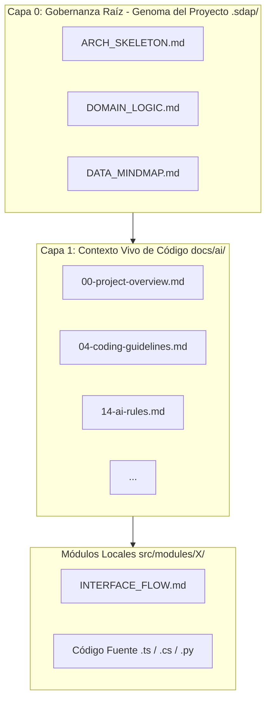

# CAPÍTULO II: EL MARCO METODOLÓGICO SDAP (LA TEORÍA)

## 2.1. Fase de Co-Diseño Conversacional (*Human-AI Inception*)

La Fase de Co-Diseño Conversacional, denominada dentro de este marco como *Human-AI Inception*, constituye la etapa de divergencia y refinamiento conceptual de la metodología SDAP. En la ingeniería de software tradicional, el proceso de descubrimiento y definición de requisitos sufre de asimetrías de información y sesgos cognitivos humanos. *Human-AI Inception* transforms esta etapa en un proceso dialéctico estructurado entre el ingeniero y un LLM conversacional, operando como un compilador de ideas antes de la generación de cualquier línea de código fuente.

El objetivo fundamental de esta fase es expandir el espacio de soluciones posibles mediante el debate técnico, para posteriormente converger en definiciones precisas. Este procedimiento se estandariza a través de un protocolo de cuatro etapas secuenciales e iterativas:

1. **Establecimiento del Alcance Teórico (*The Scope Prompt*):** El desarrollador introduce el problema de negocio y las restricciones del entorno sin solicitar implementaciones de código. El modelo es forzado a proponer múltiples alternativas arquitectónicas evaluando pros y contras.
2. **Bucle de Desafío Mutuo (*Challenge Loop*):** El ingeniero somete las propuestas de la IA a pruebas de estrés conceptuales, cuestionando la escalabilidad, posibles cuellos de botella y la selección de dependencias dentro del ecosistema tecnológico contemporáneo.
3. **Congelamiento de Contexto (*The Freezing Prompt*):** Una vez seleccionada la ruta óptima, se restringe la libertad creativa del modelo. Se le ordena sintetizar el histórico de la conversación y estructurar los requisitos funcionales purificados.
4. **Exportación de Artefactos a la Capa 0:** La IA traduce el entendimiento abstracto de la sesión en especificaciones técnicas concretas en formato Markdown y diagramas Mermaid. En este punto, la sesión conversacional concluye y el contexto se transfiere a los archivos inmutables del repositorio en el directorio `.sdap/`.

---

## 2.2. La Arquitectura Fractal de Documentación y la Doble Capa

El pilar estructural de SDAP es la sustitución del enfoque tradicional de "Documento Maestro de Requisitos" por una **Arquitectura Fractal de Documentación**. Los documentos de texto extensos y centralizados inducen fallos de atención en las IAs debido al fenómeno *Lost in the Middle*. SDAP propone una fragmentación granular del conocimiento técnico en archivos Markdown de tamaño acotado y distribuidos en dos capas principales de abstracción:

### 2.2.1. Capa 0: Gobernanza Raíz (`.sdap/`)
Constituye el "Genoma Inmutable del Proyecto". Se compone strictly de tres archivos globales y un archivo local por módulo:

* **`ARCH_SKELETON.md` (El Esqueleto):** Ubicado en `.sdap/`. Contiene el mapa de cohesión inmutable del software: descripción del sistema, fronteras tecnológicas explícitas (*Tech Fence*) y el patrón arquitectónico global. Define los límites físicos de la aplicación.
* **`DOMAIN_LOGIC.md` (Los Órganos):** Ubicado en `.sdap/`. Almacena las reglas de negocio puras, restricciones funcionales y modelos de comportamiento lógico de los actores del sistema. Gobierna qué puede y qué no puede hacer el software.
* **`DATA_MINDMAP.md` (El Sistema Circulatorio):** Ubicado en `.sdap/`. Define los contratos de datos, los esquemas de bases de datos, las firmas de entidades y las interfaces de comunicación. Garantiza la consistencia en el tipado y transporte de información.
* **`INTERFACE_FLOW.md` (Los Músculos):** Ubicado de manera local a nivel de módulo o subdirectorio (`src/modules/nombre-modulo/`). Detalla la interacción secuencial y el orden de ejecución de procesos críticos para ese componente específico.

### 2.2.2. Capa 1: Contexto Vivo de Código (`docs/ai/`)
Si la Capa 0 define el *qué* y el *por qué*, la Capa 1 mapea el *cómo*. Consiste en un conjunto estructurado de 15 archivos agnósticos a la tecnología que sirven como mapa del código existente para el agente autónomo (convenciones de nombrado, inyección de dependencias, patrones de interfaz, reglas de comportamiento y guías para añadir funcionalidades).

---

## 2.3. Modelado Visual para IAs: Mermaid como Lenguaje de Abstracción Lógica

Una de las contribuciones conceptuales más disruptivas de SDAP es la formalización de herramientas visuales basadas en texto como el canal primario de instrucción para modelos de lenguaje. Los diagramas gráficos tradicionales (PNG, JPEG) representan cajas negras de información para los mecanismos de atención, mientras que el código estructurado de **Mermaid** proporciona lógica proposicional directa y relacional de alta densidad semántica con un consumo mínimo de tokens.

SDAP estipula la correspondencia obligatoria de un tipo de diagrama Mermaid para cada documento de la gobernanza raíz:

* En `ARCH_SKELETON.md` se exige un **Diagrama de Bloques (C4 Contenedores)** para modelar la topología del sistema.
* En `DOMAIN_LOGIC.md` se exige un **Diagrama de Máquina de Estados (State Machine)**. Este gráfico es crítico para agentes autónomos, ya que mapea las transiciones válidas de las entidades de negocio (ej. un pedido no puede pasar de "Cancelado" a "Entregado"), eliminando bugs de lógica operacional.
* En `DATA_MINDMAP.md` se implementa un **Diagrama de Entidad-Relación (ERD)** que restringe las consultas y la estructura de persistencia del modelo.
* En `INTERFACE_FLOW.md` se despliega un **Diagrama de Secuencia** secuencial y numerado, detallando el flujo exacto de llamadas entre componentes.

Al procesar la sintaxis de Mermaid, los LLMs indexan las relaciones de interdependencia de los componentes antes de evaluar las líneas de código, reduciendo la ambigüedad técnica a cero.

---

## 2.4. Principio de Ejecución Atómica Atada a Diagramas

El cierre operativo de la teoría SDAP es el **Principio de Ejecución Atómica Atada a Diagramas**. El error fundamental del uso de agentes de desarrollo actuales radica en proveer instrucciones ambiguas de amplio espectro (ej. *"Modifica el sistema de autenticación para que soporte JWT y maneje logs"*), lo que fragmenta la atención del agente y produce respuestas truncadas o parches redundantes.

Este principio dicta que **toda tarea delegada a una IA debe poseer un alcance strictly delimitado por una unidad gráfica indexada en la documentación**. El prompt estandarizado de SDAP forzaría la ejecución de la siguiente manera:

$$ \text{Alcance de Ejecución} = f(\text{Diagrama de Secuencia } X) \cap f(\text{Entidad ERD } Y) \cap f(\text{Regla Guardrail } Z) $$

Al aplicar esta restricción, el agente tiene prohibido proponer o modificar código fuera de las interacciones descritas explícitamente en el diagrama mapeado. El impacto científico de este principio es doble:

1. **Aislamiento de Contexto:** El agente reduce su ventana de procesamiento al subconjunto atómico del diagrama y los archivos de contexto seleccionados de `.sdap/` y `docs/ai/`, ignorando el ruido del resto de la aplicación.
2. **Determinismo Estocástico:** Como el flujo lógico ya fue resuelto por el desarrollador en el diagrama de secuencia, las capacidades del LLM se canalizan únicamente en la traducción exacta de ese flujo hacia una sintaxis de código limpia, incrementando la predictibilidad del software resultante.
