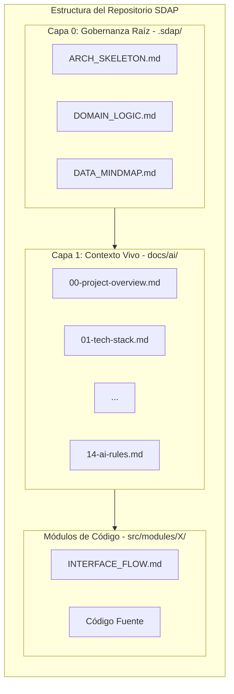

# CAPÍTULO III: LA ESTRUCTURA DE INFORMACIÓN SDAP (APLICACIÓN PRÁCTICA)

## 3.1. Visión General de la Arquitectura de Información

El estándar **Spec-Driven Agentic Programming (SDAP)** organiza el conocimiento de un repositorio de software en una estructura de información jerárquica de dos capas. Esta arquitectura garantiza que los agentes de IA dispongan del contexto necesario para operar con máxima precisión, eliminando la ambigüedad y previniendo la degradación del código fuente.

## 3.2. Capa 0: Gobernanza Raíz y Genoma del Proyecto (`.sdap/`)

La **Capa 0** se aloja en el directorio `.sdap/` en la raíz del repositorio. Constituye la "Constitución Inmutable" de la aplicación. Ningún agente puede violar las reglas o patrones definidos en esta capa.

### 3.2.1. `ARCH_SKELETON.md` (El Esqueleto Arquitectónico)
Define la estructura global del sistema, los límites de las capas y la valla tecnológica (*Tech Fence*).

* **Objetivo:** Prevenir que el agente introduzca librerías no autorizadas o modifique el patrón arquitectónico base.
* **Componentes Clave:**
  * Descripción general del patrón (ej. Clean Architecture, Hexagonal, CQRS).
  * Lista explícita de tecnologías y versiones permitidas.
  * Diagrama Mermaid de Contenedores/Bloques (C4).

### 3.2.2. `DOMAIN_LOGIC.md` (Las Reglas de Negocio)
Centraliza la lógica de dominio pura, desacoplada de cualquier implementación tecnológica o base de datos.

* **Objetivo:** Evitar que la IA implemente reglas de negocio arbitrarias o inconsistentes con los requisitos del producto.
* **Componentes Clave:**
  * Glosario de términos del dominio (*Ubiquitous Language*).
  * Reglas de validación inmutables por entidad.
  * Diagrama Mermaid de Máquina de Estados (*State Machine*) para los flujos de vida principales.

### 3.2.3. `DATA_MINDMAP.md` (Los Contratos y Modelos de Datos)
Mapea las estructuras de información, esquemas de datos e interfaces de transporte.

* **Objetivo:** Garantizar la consistencia del tipado y la integridad referencial en todo el sistema.
* **Componentes Clave:**
  * Definición de Entidades y Value Objects.
  * Diagrama Mermaid de Entidad-Relación (ERD).
  * Contratos de transferencia (DTOs, eventos de dominio).

---

## 3.3. Capa 1: Contexto Vivo de Código (`docs/ai/`)

Ubicada en `docs/ai/`, la **Capa 1** consta de 15 archivos estandarizados y agnósticos a la tecnología. Actúa como el mapa de navegación que el agente consulta para entender *cómo* está construido el software y *dónde* realizar los cambios.

### 3.3.1. Índice Estructurado de los 15 Archivos de Contexto

| Archivo | Nombre | Propósito Metodológico |
| :--- | :--- | :--- |
| `00` | `project-overview.md` | Resumen ejecutivo, propósito del software y arquitectura general. |
| `01` | `tech-stack.md` | Detalle del stack técnico, versiones, runtimes y herramientas de soporte. |
| `02` | `folder-structure.md` | Árbol del proyecto y guía de ubicación de archivos según su responsabilidad. |
| `03` | `architecture-patterns.md` | Explicación detallada del patrón de diseño implementado (ej. Ports & Adapters). |
| `04` | `coding-guidelines.md` | Convenciones de nombrado, estilo de código y estándares de formateo. |
| `05` | `ui-patterns.md` | Estándares de componentes UI, gestión de estado en cliente y diseño visual. |
| `06` | `data-flow.md` | Ciclo de vida de las peticiones desde la entrada hasta la persistencia. |
| `07` | `services-layer.md` | Especificación de servicios de aplicación, casos de uso y orquestación. |
| `08` | `database-orm.md` | Estrategias de persistencia, migraciones, ORM/Query builders y repositorios. |
| `09` | `error-handling.md` | Estructura de excepciones, códigos de error y respuestas estandarizadas. |
| `10` | `auth-security.md` | Protocolos de autenticación, autorización, RBAC y manejo de secretos. |
| `11` | `testing-strategy.md` | Estrategia de pruebas unitarias, de integración, mocks y cobertura mínima. |
| `12` | `dependencies.md` | Gestión de paquetes externos, módulos compartidos y políticas de actualización. |
| `13` | `how-to-add-features.md` | Algoritmo paso a paso para que el agente añada una nueva funcionalidad. |
| `14` | `ai-rules.md` | Lista de barreras de contención (*Guardrails*) y prohibiciones explícitas para la IA. |

---

## 3.4. Documentación Local de Módulo: `INTERFACE_FLOW.md`

A diferencia de la Capa 0 y la Capa 1 (que son globales), el archivo `INTERFACE_FLOW.md` se ubica dentro de cada módulo o paquete específico (`src/modules/nombre-modulo/`).

* **Propósito:** Detallar la interacción secuencial y el orden de ejecución de procesos críticos para ese componente en particular.
* **Artefacto Obligatorio:** Debe incluir un **Diagrama de Secuencia Mermaid** numerado.
* **Rol en la Ejecución Atómica:** Es el archivo principal referenciado en el prompt de ejecución para delimitar el alcance de la tarea del agente.

---

## 3.5. Protocolo de Inyección de Contexto para Agentes

Para optimizar el uso de la ventana de contexto y prevenir el fenómeno *Lost in the Middle*, la selección de archivos inyectados al agente debe realizarse bajo el siguiente criterio de filtrado atómico:

$$ \text{Contexto Inyectado} = \{ \text{.sdap/}, \text{ docs/ai/14-ai-rules.md}, \text{ docs/ai/04-coding-guidelines.md}, \text{ INTERFACE_FLOW.md local} \} $$

Este enfoque garantiza que el agente reciba únicamente las restricciones inmutables y el mapa del cambio local, maximizando la precisión del código generado y reduciendo al mínimo el consumo de tokens.
