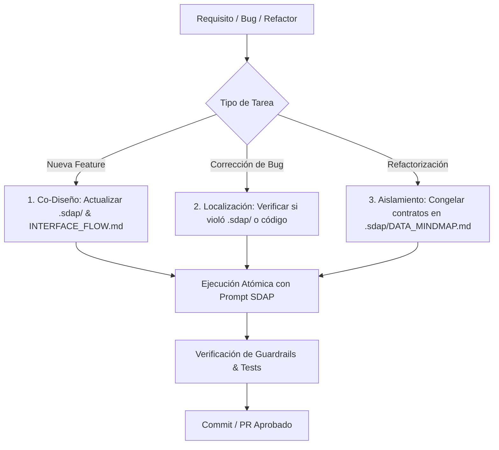

# CAPÍTULO IV: PROTOCOLOS DE INYECCIÓN, GUÍA OPERATIVA Y EJECUCIÓN PRÁCTICA

## 4.1. El Protocolo de Inyección de Contexto (*Context Injection Protocol*)

El éxito del estándar **Spec-Driven Agentic Programming (SDAP)** radica en transformar la interacción con el agente en un proceso determinista y acotado. Para evitar que el Modelo de Lenguaje de Gran Escala (LLM) caiga en el fenómeno *Lost in the Middle* o sufra degradación por saturación de tokens, SDAP establece un protocolo estricto de empaquetado de payload para los prompts de ejecución.

### 4.1.1. Estructura Estándar del Payload
Cada invocación orientada a tareas de código (*task execution*) debe componerse exactamente de cuatro bloques lógicos, delimitados por etiquetas tipo XML para maximizar la capacidad de parséo semántico de los transformadores:

# CAPÍTULO IV: PROTOCOLOS DE INYECCIÓN, GUÍA OPERATIVA Y EJECUCIÓN PRÁCTICA

## 4.1. El Protocolo de Inyección de Contexto (*Context Injection Protocol*)

El éxito del estándar **Spec-Driven Agentic Programming (SDAP)** radica en transformar la interacción con el agente en un proceso determinista y acotado. Para evitar que el Modelo de Lenguaje de Gran Escala (LLM) caiga en el fenómeno *Lost in the Middle* o sufra degradación por saturación de tokens, SDAP establece un protocolo estricto de empaquetado de payload para los prompts de ejecución.

### 4.1.1. Estructura Estándar del Payload
Cada invocación orientada a tareas de código (*task execution*) debe componerse exactamente de cuatro bloques lógicos, delimitados por etiquetas tipo XML para maximizar la capacidad de parséo semántico de los transformadores:

```xml
<sdap_context>
  <!-- BLOQUE 1: RESTRICCIONES INMUTABLES (CAPA 0) -->
  <governance_rules>
    [Contenido o extracto relevante de .sdap/ARCH_SKELETON.md]
    [Contenido o extracto relevante de .sdap/DOMAIN_LOGIC.md]
  </governance_rules>

  <!-- BLOQUE 2: BARRERAS DE CONTENCIÓN (CAPA 1) -->
  <guardrails>
    [Contenido de docs/ai/14-ai-rules.md]
    [Contenido de docs/ai/04-coding-guidelines.md]
  </guardrails>

  <!-- BLOQUE 3: DELIMITACIÓN LOCAL DE LA TAREA -->
  <execution_boundary>
    [Contenido del INTERFACE_FLOW.md del módulo específico]
  </execution_boundary>

  <!-- BLOQUE 4: INSTRUCCIÓN ATÓMICA DE EJECUCIÓN -->
  <task_instruction>
    [Descripción puntual del objetivo, haciendo referencia explícita al Diagrama de Secuencia]
  </task_instruction>
</sdap_context>xml
<sdap_context>
  <!-- BLOQUE 1: RESTRICCIONES INMUTABLES (CAPA 0) -->
  <governance_rules>
    [Contenido o extracto relevante de .sdap/ARCH_SKELETON.md]
    [Contenido o extracto relevante de .sdap/DOMAIN_LOGIC.md]
  </governance_rules>

  <!-- BLOQUE 2: BARRERAS DE CONTENCIÓN (CAPA 1) -->
  <guardrails>
    [Contenido de docs/ai/14-ai-rules.md]
    [Contenido de docs/ai/04-coding-guidelines.md]
  </guardrails>

  <!-- BLOQUE 3: DELIMITACIÓN LOCAL DE LA TAREA -->
  <execution_boundary>
    [Contenido del INTERFACE_FLOW.md del módulo específico]
  </execution_boundary>

  <!-- BLOQUE 4: INSTRUCCIÓN ATÓMICA DE EJECUCIÓN -->
  <task_instruction>
    [Descripción puntual del objetivo, haciendo referencia explícita al Diagrama de Secuencia]
  </task_instruction>
</sdap_context>
```

## 4.2. Plantilla Estandarizada del Prompt de Ejecución (The SDAP Prompt)
A continuación se define la plantilla oficial de instrucción que el desarrollador (o la herramienta de orquestación) debe proveer al agente autónomo para la ejecución de una tarea de desarrollo:

### ROL Y MODO DE OPERACIÓN
Actúas como un Agente de Ejecución de Código estricto bajo la metodología Spec-Driven Agentic Programming (SDAP).
Tu único objetivo es implementar la tarea descrita sin desviarte de las fronteras arquitectónicas ni de las reglas de negocio provistas.

### REGLAS DE GOBERNANZA (INMUTABLES)
1. **Tech Fence:** No puedes agregar dependencias, librerías o paquetes externos no autorizados en `<governance_rules>`.
2. **Domain Logic:** Las reglas de validación y estados definidos en la máquina de estados de dominio son inviolables.
3. **Boundary Control:** Solo estás autorizado a modificar o crear archivos dentro del alcance definido en `<execution_boundary>`. Prohibido refactorizar o tocar código fuera de esta frontera.

### TAREA A EJECUTAR
- **Objetivo:** Implementar el paso [Nº] del Diagrama de Secuencia en `INTERFACE_FLOW.md`.
- **Entrada esperada:** [Especificar DTO/Entidad de entrada].
- **Salida esperada:** [Especificar DTO/Respuesta esperada].

### INSTRUCCIÓN DE COMPORTAMIENTO
Analiza el flujo en `<execution_boundary>`, verifica las barreras de contención en `<guardrails>` y genera únicamente el código fuente necesario, acompañado de sus correspondientes pruebas unitarias bajo las convenciones del proyecto.

## 4.3. Casos de Uso Prácticos y Flujos de Trabajo (Workflows)
SDAP no solo rige la creación de código nuevo, sino que proporciona flujos de trabajo estandarizados para las operaciones habituales del ciclo de vida del software.



### 4.3.1. Caso de Uso A: Implementación de una Nueva Funcionalidad (*New Feature*)
1. **Fase Inception:** El humano y la IA conversacional actualizan `.sdap/DOMAIN_LOGIC.md` si hay nuevas reglas, y crean el `INTERFACE_FLOW.md` dentro del módulo correspondiente (`src/modules/nuevo-modulo/`).
2. **Empaquetado:** Se inyecta la Capa 0 (`.sdap/`), los guardrails (`docs/ai/14-ai-rules.md`) y el `INTERFACE_FLOW.md` del nuevo módulo.
3. **Ejecución:** El agente genera el código base y las pruebas asociadas al flujo especificado.

### 4.3.2. Caso de Uso B: Resolución de Incidentes (*Bug Fixing*)
1. **Diagnóstico:** El desarrollador identifica si el bug es por divergencia de reglas de negocio o un fallo de implementación local.
2. **Ajuste de Especificación:** Si el bug reveló un caso de borde (*edge case*) no contemplado, primero se actualiza la especificación en `.sdap/DOMAIN_LOGIC.md` o el Diagrama de Secuencia local.
3. **Ejecución Restringida:** Se inyecta la especificación corregida y el fragmento de código afectado. El agente ajusta la implementación asegurando que los test existentes sigan pasando.

### 4.3.3. Caso de Uso C: Refactorización Controlada
1. **Congelamiento de Contratos:** Se valida que `.sdap/DATA_MINDMAP.md` (interfaces y DTOs) permanezca inmutable.
2. **Inyección de Reglas de Código:** Se enfatiza el archivo `docs/ai/04-coding-guidelines.md` en el payload.
3. **Ejecución:** El agente refactoriza la estructura interna del módulo sin alterar las firmas de las interfaces públicas expuestas en la Capa 0.

---

## 4.4. Barreras de Contención y Prevención de Deriva (*Guardrails*)

Para asegurar que los agentes autónomos operen con alta fidelidad, la Capa 1 define el archivo `docs/ai/14-ai-rules.md`. Este archivo actúa como una lista explícita de directivas relativas a la conducta del modelo:

### Ejemplo de Guardrails Estándar (`docs/ai/14-ai-rules.md`)
* **Prohibición de Suposiciones Lógicas:** "Si un requisito o contrato de datos es ambiguo, detén la ejecución y solicita aclaración. No asumas campos opcionales ni inventes valores por defecto."
* **Prohibición de Modificaciones Masivas:** "Está estrictamente prohibido modificar archivos de configuración raíz (`package.json`, `tsconfig.json`, `Dockerfile`, etc.) a menos que el prompt lo ordene explícitamente."
* **Preservación de Firma de Métodos:** "Ninguna refactorización local puede alterar las firmas de las interfaces de dominio públicas definidas en `.sdap/DATA_MINDMAP.md`."
* **Cero Código Muerto / TODOs:** "No dejes comentarios `// TODO:` ni bloques de código comentados. Toda implementación debe estar completa o fallar explícitamente mediante excepciones tipadas."

---

## 4.5. Conclusiones del Estándar SDAP

El estándar **Spec-Driven Agentic Programming (SDAP)** transforma el paradigma del desarrollo asistido por IA, transitando desde un modelo artesanal basado en la intuición de prompts informales hacia una **disciplina de ingeniería rigurosa, predecible y auditable**.

Al desacoplar la gobernanza inmutable (`.sdap/`) del contexto vivo de código (`docs/ai/`), utilizar diagramas como especificaciones ejecutables (Mermaid) y restringir la ventana de atención del agente mediante la ejecución atómica, SDAP mitiga las limitaciones matemáticas subyacentes en los transformadores (*Lost in the Middle*, $O(N^2)$ en consumo de tokens). Como resultado, la ingeniería de software guiada por especificaciones garantiza que el ser humano mantenga el control arquitectónico estratégico mientras la IA despliega su máxima capacidad en la ejecución técnica limpia.
